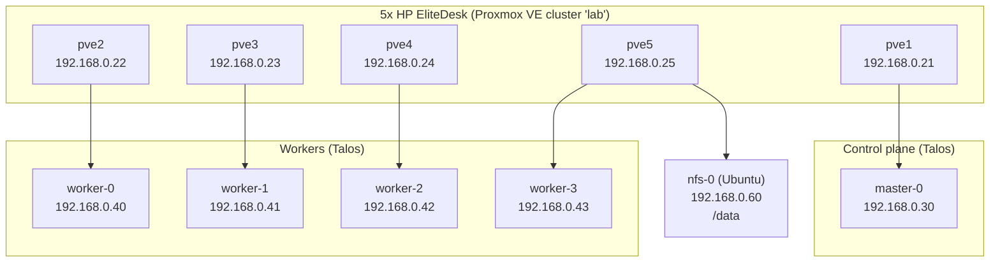
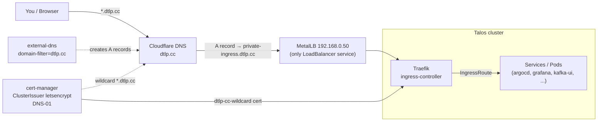
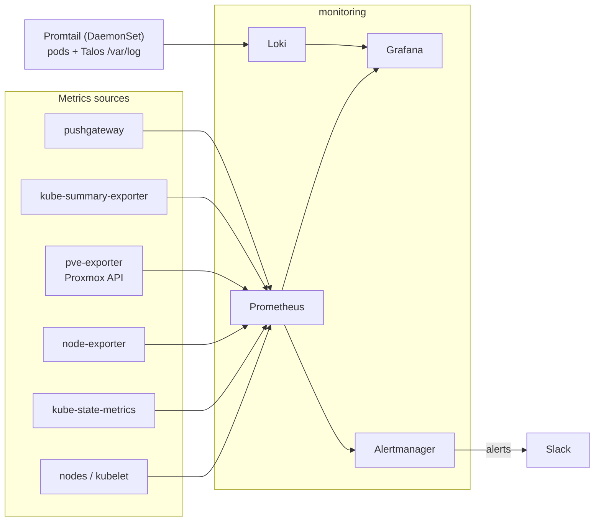
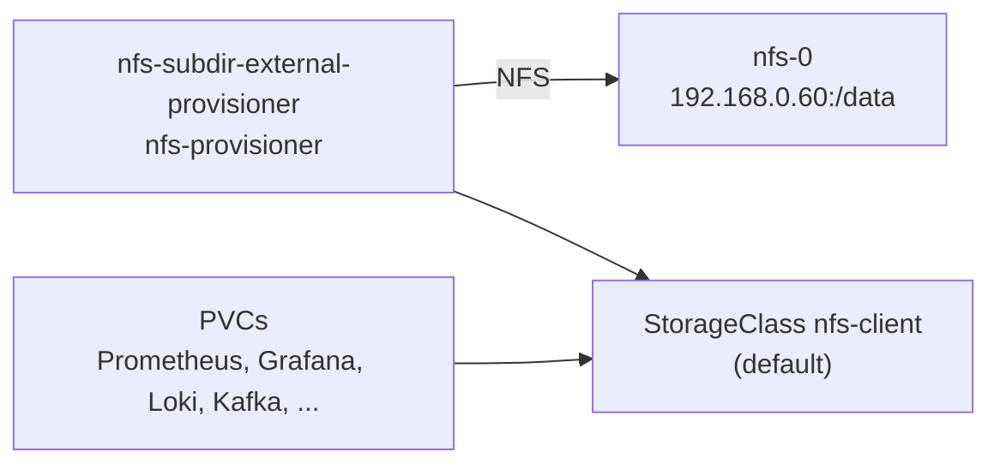
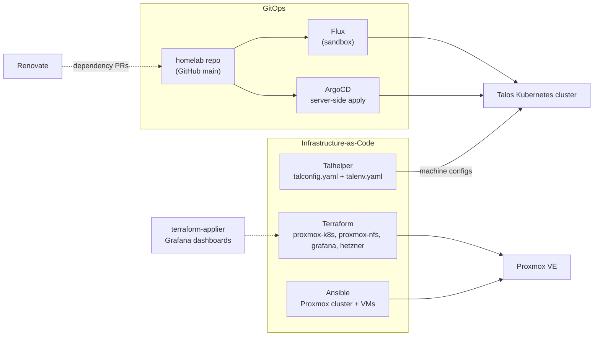

# Homelab Architecture

A Talos Kubernetes cluster running on 5 Proxmox VE hosts, managed as
infrastructure-as-code from this repository via Terraform, Talhelper, and
ArgoCD.

## Infrastructure

Five HP EliteDesk nodes form a single Proxmox VE cluster (`lab`). Each hosts
Talos Kubernetes VMs; an Ubuntu VM provides shared NFS storage. All VMs use
static addresses matched by MAC, with 192.168.0.1 as the gateway.

## Ingress and TLS

All external traffic arrives as `*.dtlp.cc`, resolves through Cloudflare to the
Traefik LoadBalancer, and is terminated with a wildcard TLS certificate issued
via cert-manager DNS-01.

## Observability

Metrics are scraped by Prometheus, alerts route to Slack, and logs flow
through Loki into Grafana.

## Storage

Shared storage comes from the nfs-0 VM and is exposed to the cluster through a
dynamic NFS provisioner.

## GitOps and provisioning

Infrastructure is bootstrapped and kept in sync from this repository.

## Key services

| Service                             | Namespace          | Purpose                                                |
| ----------------------------------- | ------------------ | ------------------------------------------------------ |
| Traefik                             | ingress-controller | Ingress controller, only LoadBalancer (192.168.0.50)   |
| ArgoCD                              | argocd             | GitOps deployment of namespaces                        |
| Flux                                | flux-system        | GitOps for the sandbox namespace                       |
| Prometheus + Alertmanager + Grafana | monitoring         | Metrics, alerting (Slack), dashboards                  |
| Loki + Promtail                     | monitoring         | Log aggregation from pods and Talos hosts              |
| cert-manager                        | kube-system        | TLS certificates (Cloudflare DNS-01)                   |
| external-dns                        | kube-system        | DNS records for `*.dtlp.cc`                            |
| MetalLB                             | metallb-system     | LoadBalancer IP allocation                             |
| Kyverno                             | kube-system        | CEL validating policies                                |
| nfs-provisioner                     | nfs-provisioner    | NFS-backed default StorageClass                        |
| Kafka + kafka-ui                    | kafka              | Streaming / message broker                             |
| terraform-applier                   | terraform-applier  | Runs Terraform modules in-cluster (Grafana dashboards) |

## Provisioning

- **Ansible** bootstraps the Proxmox cluster (formation, SSH, NVMe mount) and
  the Ubuntu cloud image for the NFS VM.
- **Terraform** (`terraform/proxmox/k8s`) provisions the Talos VMs on Proxmox
  (disk images, networking, resource sizing) and applies Talos machine configs.
  Talos and Kubernetes versions come from `talos/talenv.yaml`; machine secrets
  are imported from Talhelper via `make import-secrets`.
- **Talhelper** (`talos/`) generates the Talos machine configs from
  `talconfig.yaml` and the strongbox-encrypted `talsecret.yaml`.
- **ArgoCD** watches the repository's `kubernetes-manifests/` and applies each
  namespace's kustomization (server-side apply); **Flux** manages the sandbox
  namespace. Renovate opens dependency update PRs.
